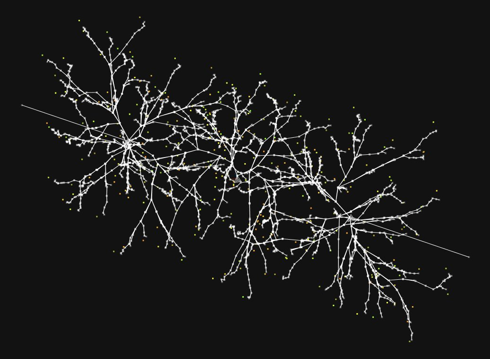
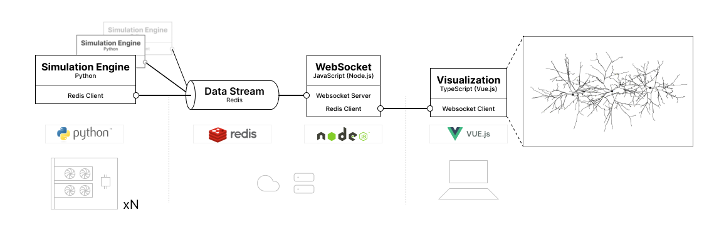
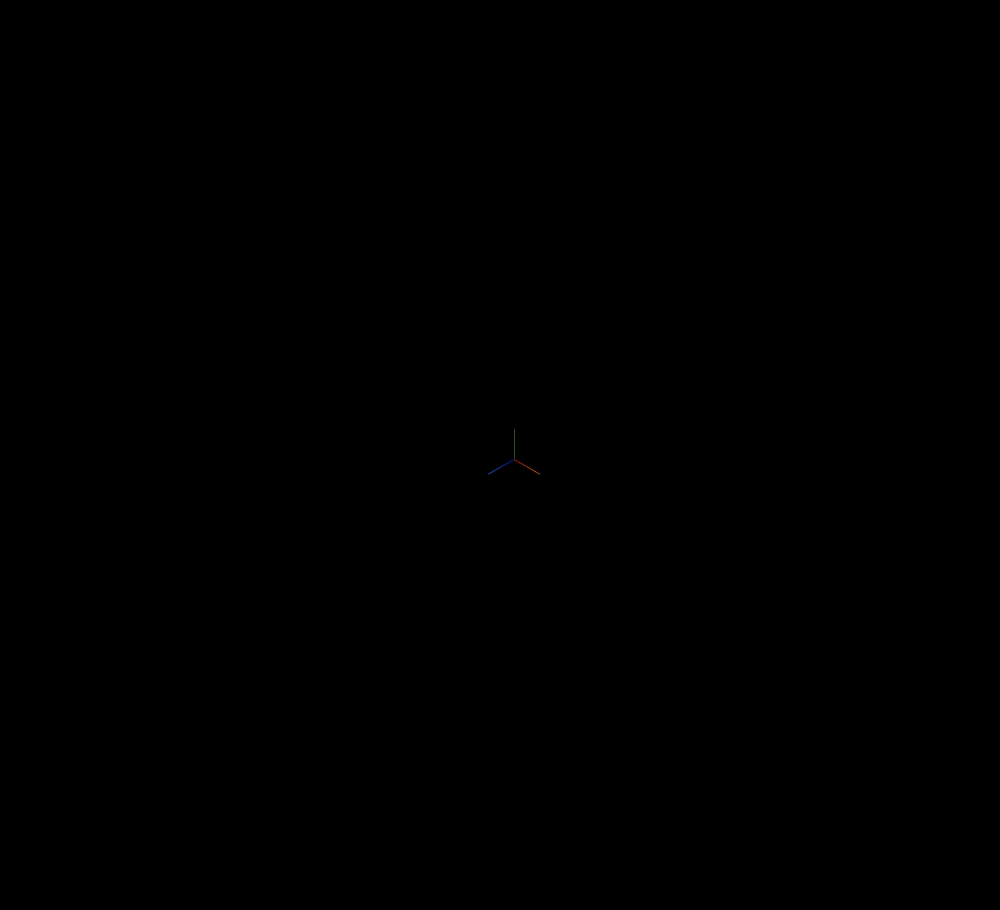
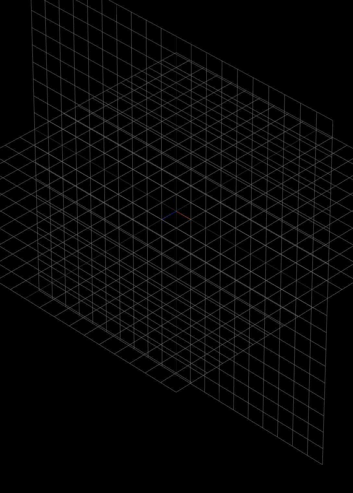

# Neuronal Morphogenesis Simulations

Neuronal morphogenesis inspired simulation tool. 
I covered in more details about this project this 2021 essay [on Neuromorphology](https://www.notion.so/lucascassiano0/Essays-on-Neuromorphology-and-cognition-72a0442187e04558b4fafaaece3b9dc3).



## Architecture

This design allows many GPUs to post simulation output, in near-real-time, to a single rendering client view (web).



## Running locally

```sh
$ docker compose up 
# open web browser at localhost:8080

# on another terminal
$ cd python_simulations
$ pip install -r ./requirements.txt
$ python3 neuro_sim.py
```

## Examples



